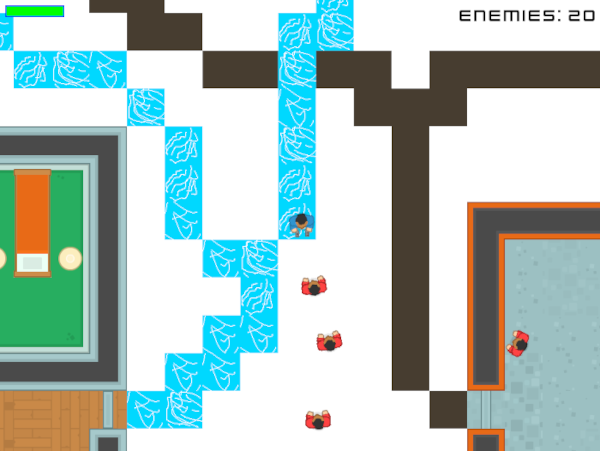
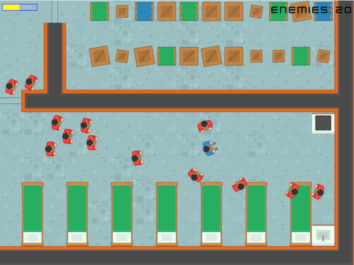
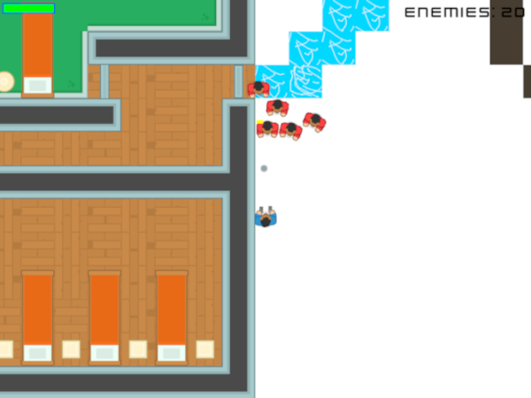

# Penguins
### One of the largest games I have ever made

---

Penguins is a game made over a year during the toughest parts of the COVID-19 pandemic.
It was originally a project I had decided to create to entertain my family, but the game
has grown since. It mainly uses the Python and the Pygame library.

The idea behind the simplistic gameplay was to defeat all the enemies every map.

## Features

---

 - Simplistic yet open gameplay allowing many people to be able to pick it up
 - Multiple levels for a more diverse experience
 - An intuitive UI to select levels and difficulty

## Requirements

---

#### Python is required to run the game

In order to run the source code, the following python libraries are required:
 - Pygame
 - Pytweening
 - Guizero
 - Pytmx

 ---
